# Case Study Submission

## Project Overview
<i>The purpose of this project is to satisfy the requirements for graduation from Per Scholas program.</i>  

This application allows a user to make an account or login to an existing account and view stock market information. The user selects which companies to view information about and an API call is made to return a JSON object to this application, where the information is presented to the user. 

# How to setup
<b>Step 1:</b> Navigate to https://github.com/nick-devos/casestudy.fullstack_webapplication and clone the project. 
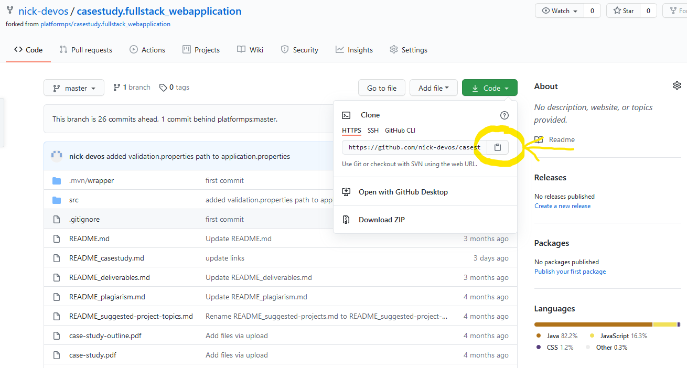
Use your `git bash` terminal to clone a copy of the project to the local directory of your choosing.

<b>Step 2:</b> This project uses MySql to persist login credentials and requires some configuration to do so. First, navigate to your MySql Workbench and take note of the username, password (will not be shown), and host location needed to to access the DBMS.
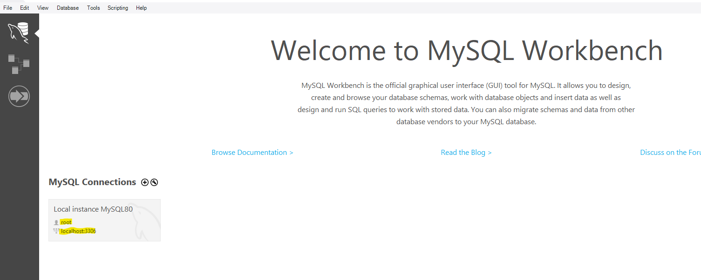
We will need to create a database for the program to use, so enter the DBMS and create a database by writing one simple statement. Here I have chosen to call the database `casestudy`. So, my statment is `create database casestudy;` Execute the statement and make sure it is successful by checking the output.
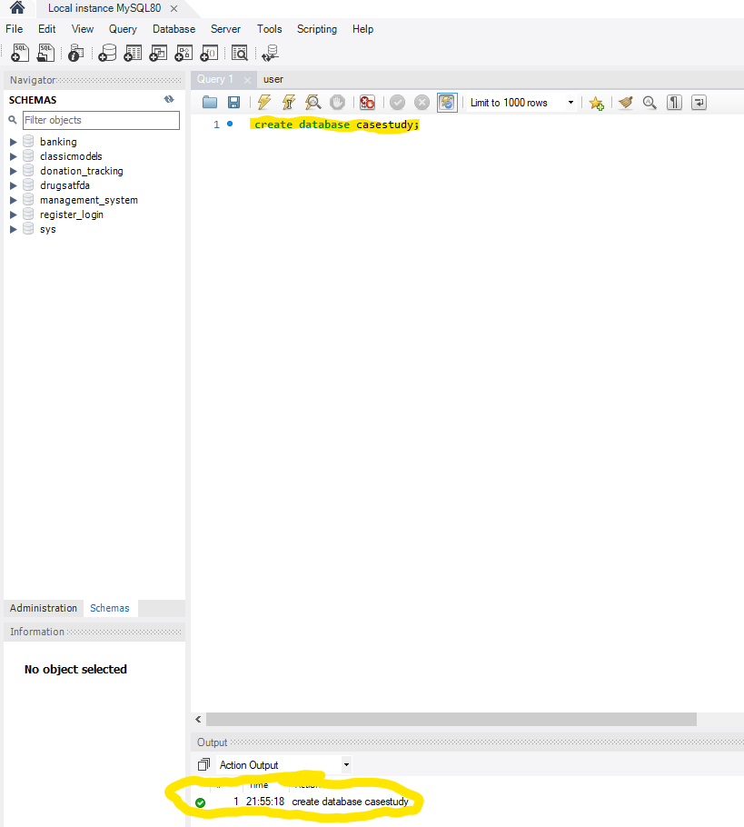

<b>Step 3:</b> Now we will make sure the program points to the correct database. Navigate to the project directory and open the `pom.xml` file in your IDE. 
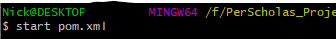
Once the project is built, navigate to the `application.properties`. If needed, change the `spring.datasource.url`, `spring.datasource.username`, and `spring.datasource.password` to reflect your own settings noted in step 2.
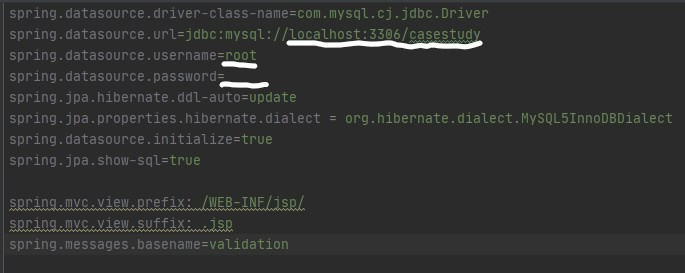

<b>Step 4:</b> Run the project. This can be accomplished by pressing `Shift + F10` if you're on a PC. Alternatively, in the menu on top of the window, click `Run` &rarr; `Run 'CasestudyApplication'`. If you have maven installed, you can use the command `mvn spring-boot:run`. If something is already running on port 8080, run the `kill-8080.bat` or `kill-8080.sh` included in the project files. Ensure that the project begins running.

<b>Step 5:</b> Open an internet browser and navigate to `localhost:8080/login`. This is where you will login after creating an account. Click `Create an account` under the login button. This will redirect you to the registration page. Create a username and password (username must be 6-32 characters, password must be at least 8 characters).

Upon successful creation of a user, you will be redirected to the welcome screen.
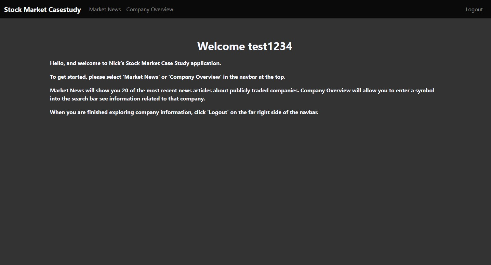
From here you can use the links in the navbar to navigate to the pages available to logged-in users.

# Exploring the program

<b>Market News: </b> The market news page allows a user to see the 20 most recent news articles for the entire market provided by Finnhub's API.
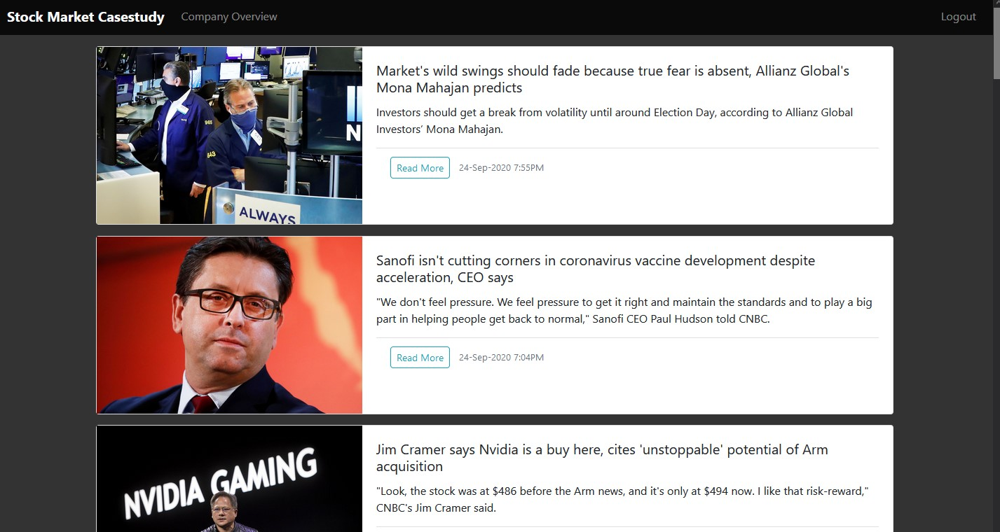

<b>Company Overview: </b> The company overview page is the most complex and powerful page of the project. Upon navigating to the page, it is auto-populated with data for Amazon.
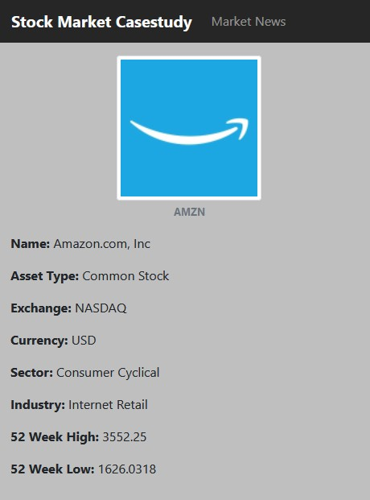
However, a user may use the search bar at the top to enter the symbol/ticker of a desired stock, such as 'TSLA' for Tesla, and the page will show data for that particular stock. This page uses 3 seperate API's to populate data (Finnhub, AlphaVantage, and IEXCloud).
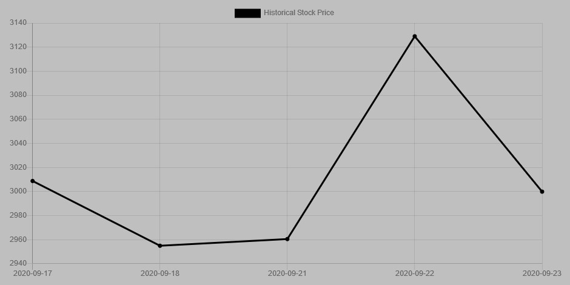
One of the data points provided is a 5 day price chart of the stock price of the security. This is done using the Chart.js open-source library. (Note: Sometimes the chart fails to render on load, however if you resize the window, the chart will populate with data.)
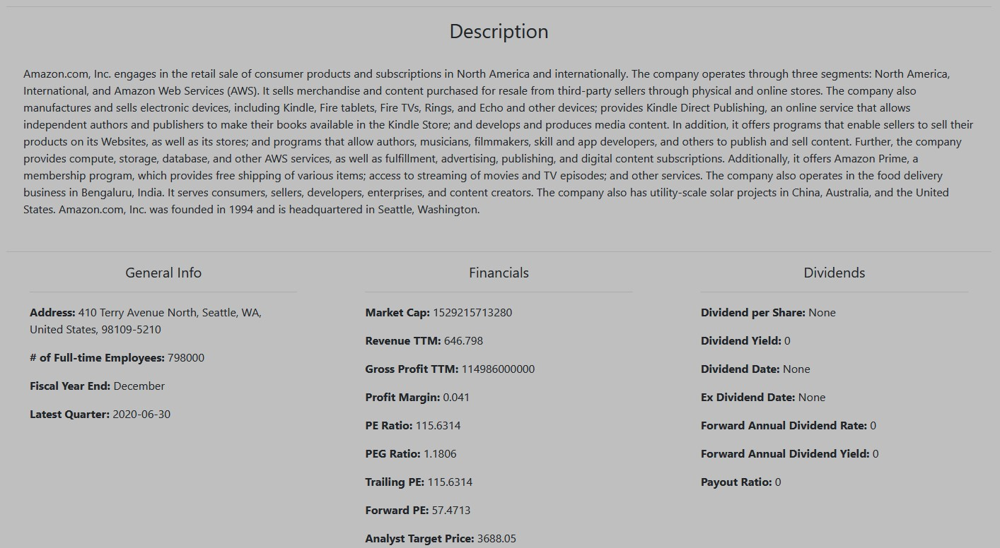
Under the chart is the company's description and general information about the company, financial information, and dividend information.
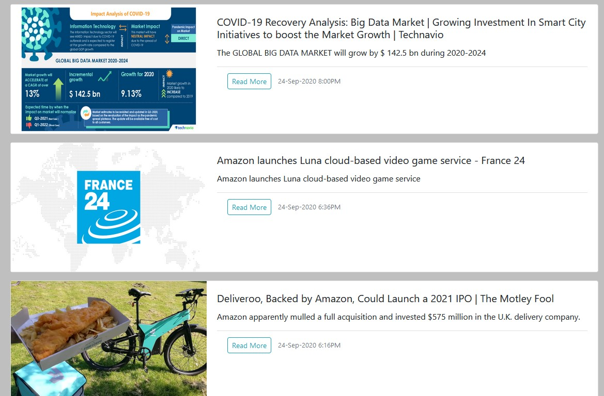
On the bottom of the page is news articles directly related to the security specified. The program is designed to fetch the last month's worth of articles however, it also displays a max of 21 articles so you don't have hundreds of articles on one page for companies like Amazon with large quantities of articles.

When you're done using the program just click the `Logout` link at the top right of the window (far right of the navbar) and you will be logged out and redirected to the login page, where you will see a message displaying that you have successfully logged out.
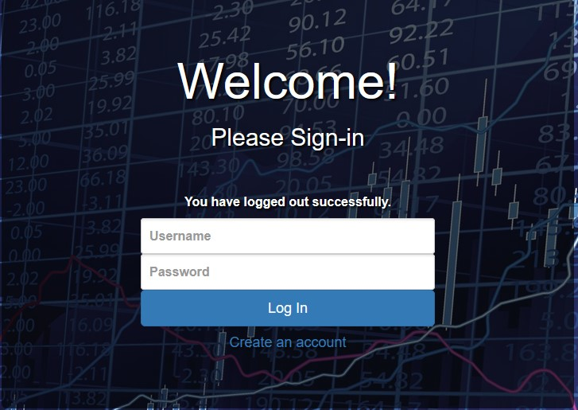

# How it works
Due to the constant changing of information in the stock market, the stock data is not persisted into the database. Each time you load the market news page one API call is made to Finnhub. Loading the company overview page and each subsequent change of stock symbols makes a total of 4 API calls (AlphaVantage: 1, Finnhub:1, IEXCloud: 2). Since data is not being persisted to the database, API calls are made in JavaScript and displayed in HTML. JavaScript receives JSON data from the external API's and uses templates created by me to display the parsed JSON elements in their desired locations. <b>Due to the use of free tokens from API providers, you may hit the limit for API calls and get an error instead of receiving company data if too many API calls are made in a short period of time.</b>

Login functionality is made possible with Spring Security. The program uses custom login and registration JSP pages to gather information from the user.

###### Technologies used
* Spring MVC &rarr; Java
* JSP &rarr; HTML, CSS, Js
* MySQL
* Git