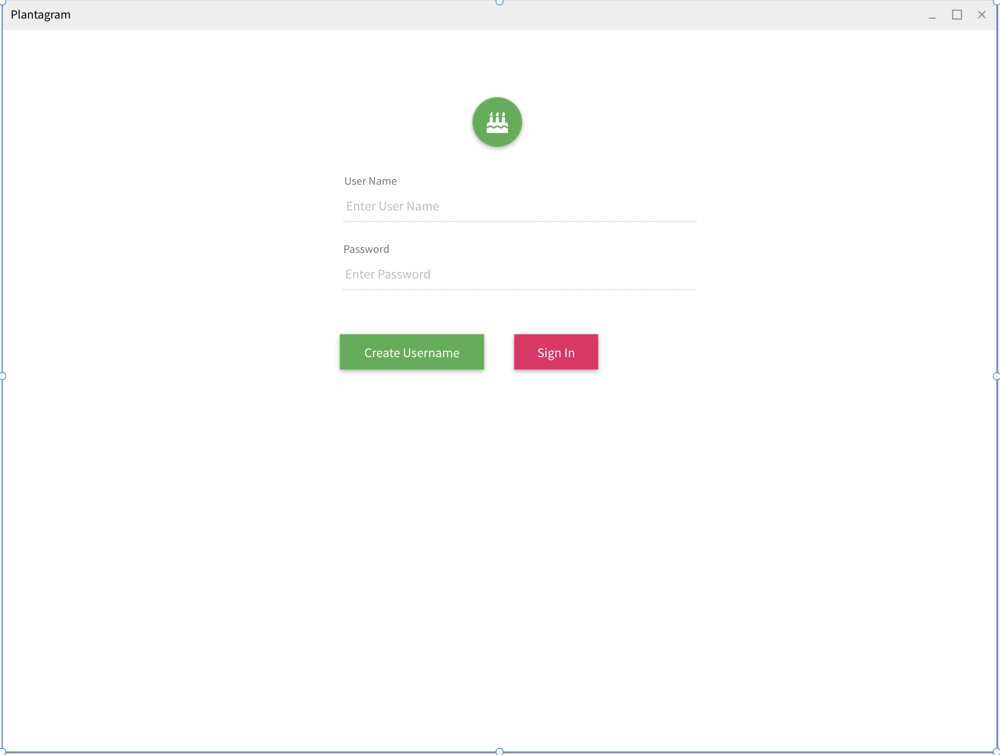
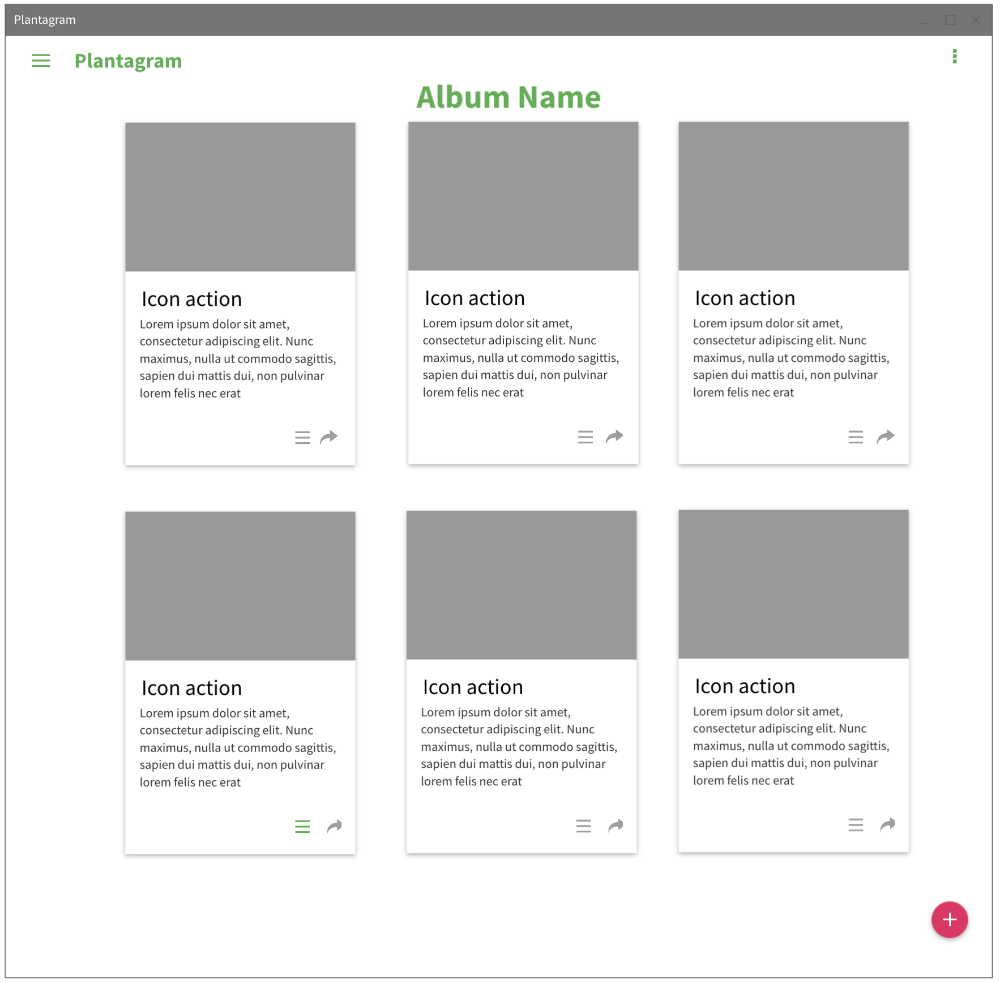
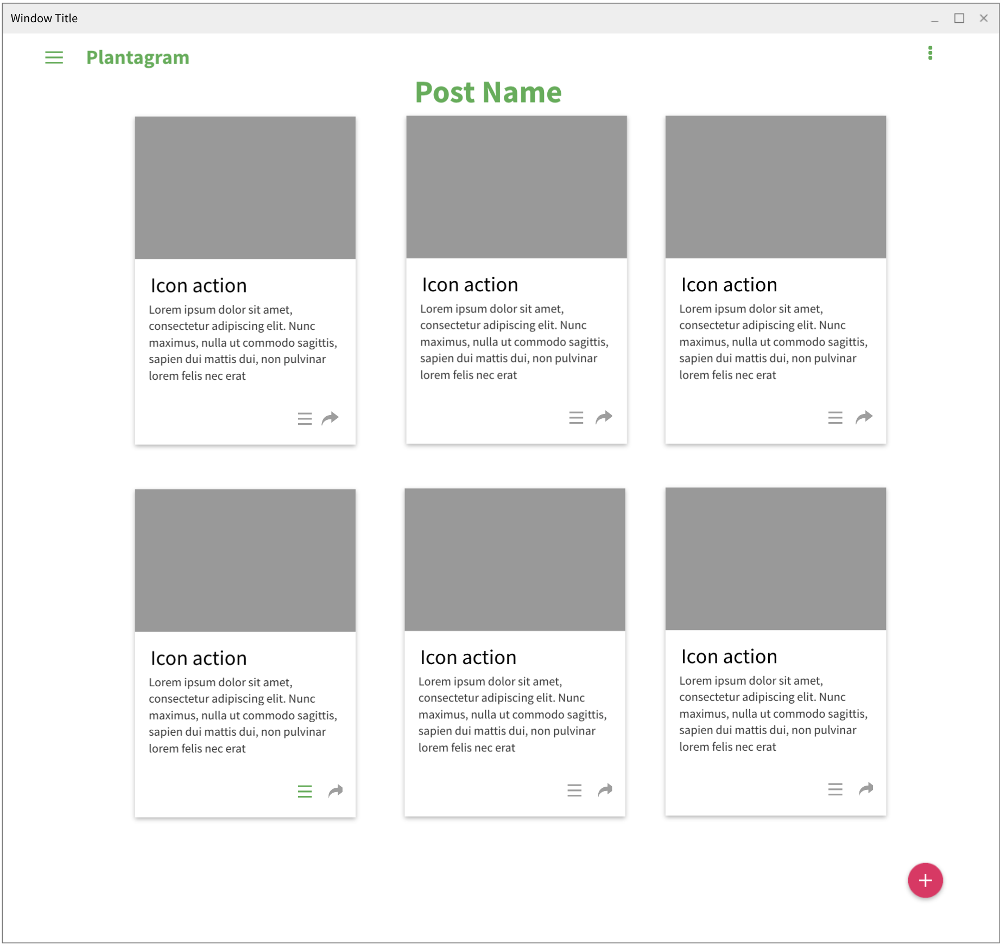

# Plantagram Full Stack Web Application 

## Description
Plantagram is an online journal service to store albums and posts about your current garden operations so they can be accessed anywhere with an internet connection

## Requirements to run applicaiton locally
Node/NPM/YARN, IntelliJ IDEA/Eclipse and a valid mysql databse to seed before beginning the operation for testing purposes 

## Technologies Used 

### Back End
Java, Spring, Spring Data JPA, Maven, MySQL, Auth0

### Front End
React, Material UI, Auth0, CSS

## WireFraming/Front-end Design
* **Mockflow Design** 

* **Objective** - to create an implementation of a web service utilizing Java/Spring
* **Purpose** - to demonstrate the construction of a full-stack web-application
* **Description**

## Developmental Notes

### Installation
* It is advised that you install each of the following technologies
  * Install [NodeJs](https://nodejs.org/en/).
  * Install [IntellijIDEA](https://www.jetbrains.com/idea/).
  * Install [Maven] version 3.0 or higher(https://maven.apache.org/download.cgi).

### Getting Up and Running

#### Front End
* In your terminal once in the base branch of the project navigate to the frontend folder and use yarn add to download the necessary dependencies to start the front end of the applicaiton 

#### Back End
* In Intellij Make sure your project is set up correctly by opening it with the pom.xml file 

