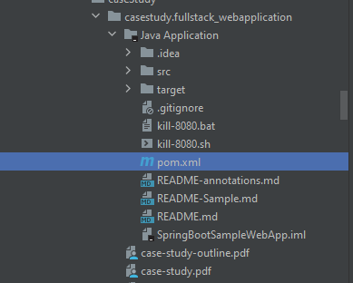
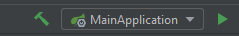
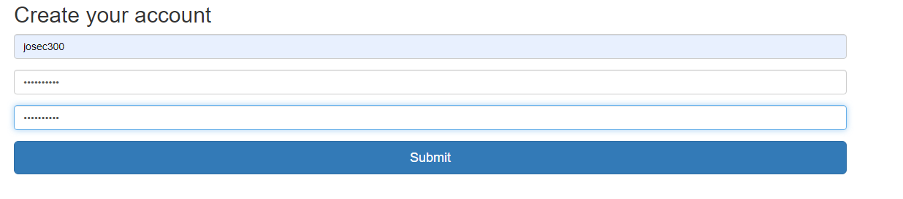

# Full Stack Web Application: Calorie Counter 

* **Objective** - to create an implementation of a web service
* **Purpose** - to demonstrate the construction of a full-stacked web-application
* **Description**
	* This is a **Restful application** that requests information from a user using the front end and presists information in a database
	* The application supports login functionality
	* This web app will Count the nutrients from each of your foods in your diet to help you make better decision on what to eat.
	* You will put your 4 foods types in the calorie counter and be able to save your diets for future reference.
	* Food type:
		* Breakfast
		* Lunch
		* Dinner
		* Snacks
	* It counts the following nutrients.
		* Calories
		* Carbs
		* Fat
		* Protien
		* Sodium
		* Sugar
		
* **Technlogies**
	* Spring boot
	* Java 8
	* Jsp
	* HTML
	* CSS
	* BootStrap
	
* **How to get set up**
1. clone the repository:
*  
2. open the project from intelj using the pom.xml file
 * 
3. run the MainApplication.java class (this should not require any other libraries to download)
* 
4. type in any browser except internet explorer and type [http://localhost:8080/login_form]
* 
5. you will note be able to login in the beginning, click on register and create your account
* 
6. If you see an error page after registering this is a known problem that I am working on fixing.
	* the other parts of the app are not implemented yet and will take more time to complete.

* **Issues**
	* As of this moment only the login is complete and need to implement the classes created.
	* At the moment all the classes needed are completed and the frontend of the applcation for the calorie counter still needs to be completed.
	* A completed version of the appicaiton will be ported to another branch since the main branch will be graded.
	* Hope this clarifies some confusion.
	
